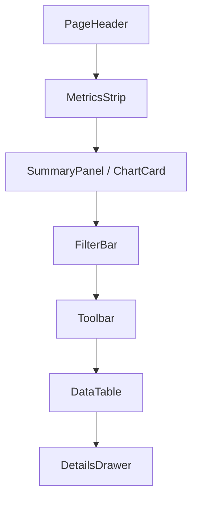
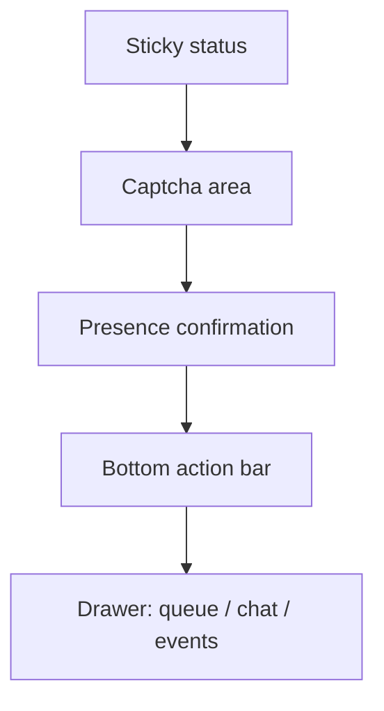

# EOPP Frontend Design System

## Цель

Дизайн-система EOPP нужна как стабильный операционный UI foundation для React frontend. Она должна убрать ad-hoc layout-ы, разрозненные кнопки, формы, таблицы и статусы, а также дать разработчикам и LLM единый способ собирать новые страницы без верстки с нуля.

Главная цель: Ant Design используется как базовая UI-библиотека, а `frontend/src/ui` становится единым EOPP API для controls, patterns и page templates.

## Принципы

- Базовые визуальные и интерактивные компоненты строятся на Ant Design.
- Бизнес-семантика EOPP живет в тонких wrappers поверх Ant Design.
- Новые и мигрируемые страницы импортируют базовый UI из `frontend/src/ui`, а не напрямую из `antd`, кроме редких исключений.
- Если исключение повторяется больше одного раза, оно становится UI foundation компонентом.
- Page templates задают устойчивую рамку, но не диктуют весь контент страницы.
- Реальные экраны собираются из composable sections: metrics, filters, toolbar, tables, charts, drawers, forms.
- Интерфейс остается рабочим, плотным, спокойным и пригодным для ежедневного использования.
- Не создаем landing page, декоративные фоны, случайные градиенты или маркетинговую композицию.

## Слои

```text
Ant Design
  ConfigProvider
  theme tokens
  Layout / Table / Form / Button / Tag / Drawer / Tabs / Statistic

EOPP UI foundation
  controls
  components / patterns
  layouts / templates
  charts
  theme

Feature pages
  admin / CRM
  operator workbench
  captcha home
  training
```

## Theme

Первый этап использует один темный операционный стиль без переключателя light/dark.

Density:
- `compact` для админки, CRM, финансов, аудита и больших таблиц.
- `standard` для пользовательской главной страницы на офисном экране.
- `touch` для мобильной операторской страницы.

Базовые токены:
- радиус: 6-8px для controls и panels;
- плотные вертикальные отступы для таблиц и фильтров;
- стабильные высоты toolbar, status bar, table rows и mobile action bar;
- статусные цвета: success, warning, danger, info, neutral;
- без viewport-based font scaling.

## UI API

Страницы должны использовать единый вход:

```jsx
import {
  Button,
  DataTable,
  FilterBar,
  StatusTag,
  Page,
  WorkbenchPage,
} from "../ui";
```

Прямой импорт из `antd` на feature pages допустим только для редких компонентов, которых еще нет в foundation. Повторяющийся прямой импорт должен быть обобщен в `frontend/src/ui`.

## Controls

Controls - это базовые элементы, которые должны выглядеть одинаково на всех страницах:

- `Button`: primary, secondary, danger, ghost, loading, disabled.
- `IconButton`: компактные действия в таблицах и toolbar.
- `TextInput`: единые размеры, ошибки, placeholder, disabled.
- `SelectInput`: единые размеры и empty state.
- `DateRangeInput`: единый способ фильтровать периоды.
- `CheckboxField`: чекбоксы в формах и bulk select.
- `SegmentedControl`: режимы, preset-фильтры, density.
- `FormSection`: секция формы с заголовком и help text.

Controls внутри используют Ant Design, но наружу дают EOPP-совместимый API.

## Components And Patterns

### PageHeader

Единый заголовок страницы или раздела:

```text
Title                         Actions
Subtitle / metadata           Secondary actions
```

Правила:
- не использовать hero-scale типографику внутри operational UI;
- actions справа на desktop;
- на mobile actions могут уходить в dropdown или bottom action bar.

### Toolbar

Группа действий над таблицей или секцией:

- primary action слева или справа в зависимости от сценария;
- secondary actions рядом;
- опасные действия через `ConfirmAction`;
- кнопки не прыгают при loading.

### FilterBar

Единый блок фильтров:

- построен на Ant Design Form/Grid;
- compact по умолчанию в admin/CRM;
- supports search, select, date range, toggles;
- reset/apply действия всегда в одном месте;
- не растягивает страницу при появлении ошибок.

### DataTable

Единый table pattern поверх Ant Design Table.

Обязательные правила:
- loading, empty и error states встроены в `DataTable`;
- density modes: compact, standard;
- sticky header, если таблица живет в ограниченной рабочей области;
- колонкам задаются `minWidth`, `ellipsis` и понятный `title`;
- actions находятся в правой колонке;
- bulk actions идут через `ActionBar`;
- pagination в одном стиле;
- horizontal scroll разрешен для desktop admin/CRM таблиц, но не для мобильной операторской страницы.

### AnalyticalListView

Основной CRM/admin паттерн для экранов, где таблица не единственный контент.

```text
Page
  PageHeader
  MetricsStrip
  SummaryPanel / ChartCard
  FilterBar
  Toolbar
  DataTable
  DetailsDrawer
```

Это не отдельный "тип страницы", а compositional pattern. Его можно использовать внутри `Page`, `SplitPage` или admin tab.

### MetricsStrip

Плотная строка KPI:

- total, success, errors, pending, debt, paid и другие бизнес-метрики;
- единая высота;
- без вложенных карточек;
- цвет используется только для смысла, не для украшения.

### StatusTag

Единый статусный компонент поверх Ant Design Tag/Badge.

Статусы EOPP:
- `confirmed`: успех;
- `failed`: ошибка;
- `pending`: в работе;
- `paid`: оплачено;
- `unpaid`: не оплачено;
- `online`: онлайн;
- `offline`: офлайн;
- `warning`: требует внимания;
- `neutral`: нет данных.

### ChartCard

Графики всегда показываются в `ChartCard`.

Правила:
- единая палитра из theme tokens;
- единые loading/empty/error states;
- читаемые legend и tooltip;
- не использовать случайные палитры;
- не вкладывать ChartCard в Card.

Если будет нужна chart library, варианты для отдельного решения:
- Ant Design Charts;
- Recharts;
- ECharts.

### ConfirmAction

Единый способ подтверждать опасные действия:

- delete;
- deactivate;
- issue invoice;
- reset/reconnect;
- irreversible admin operations.

## Page Templates

Templates задают устойчивую рамку страницы, но не запрещают вставлять разные content patterns.

### AppShell

Общая оболочка:

- фон приложения;
- ограничение ширины контента;
- top navigation или compact header;
- общие loading/error boundaries при необходимости.

### Page

Базовая страница:

```text
AppShell
  PageHeader
  Content sections
```

Используется для главной пользовательской страницы, training, простых admin surfaces.

### ListPage

Рамка для list/table сценариев:

```text
PageHeader
Optional metrics / analytics
FilterBar
Toolbar
DataTable
```

Не означает, что вся страница состоит только из таблицы. Над таблицей могут быть KPI, summary, charts и alerts.

### DetailPage

Сущность с деталями:

```text
PageHeader
Summary strip
Tabs
Related tables / audit / actions
```

Подходит для компании, API key, счета, оператора.

### DashboardPage

KPI + графики + таблицы:

```text
PageHeader
MetricsStrip
Chart grid
DataTable / SummaryPanel
```

Подходит для финансов, pipeline quality, нагрузки операторов.

### WorkbenchPage

Операторский рабочий экран.

Desktop:
- main/right или left/main/right layout;
- постоянный статус подключения;
- капча занимает стабильную рабочую зону;
- очередь, операторы, события и чат не вызывают layout jumps.

Mobile:
- single-column;
- sticky status сверху;
- captcha area занимает максимум полезного экрана;
- крупная primary-кнопка подтверждения присутствия;
- bottom action bar для вторичных действий;
- чат, события и очередь через Drawer/Tabs;
- no horizontal overflow;
- tap targets не меньше 44px.

Главный мобильный сценарий: быстро реагировать на капчу, удобно тыкать по изображению, подтверждать присутствие без поиска кнопки.

### SettingsPage

Формы секциями:

```text
PageHeader
FormSection
FormSection
Danger section
ActionBar
```

### SplitPage

Список и детали:

```text
Left list
Right detail panel
Optional drawer on smaller screens
```

Подходит для компаний, счетов, операторов, расследований.

## Responsive Rules

Админка и CRM:
- ориентировать на большой экран;
- высокая плотность данных;
- horizontal scroll допустим для широких таблиц;
- mobile не является основным сценарием.

Главная пользовательская страница:
- ориентировать на офисный desktop/laptop;
- допускается больше воздуха, чем в CRM;
- не превращать в landing page.

Операторская страница:
- mobile-first для основного сценария;
- desktop также должен быть устойчивым;
- secondary panels скрываются в Drawer/Tabs;
- status и текущая задача всегда доступны.

## Spacing Rules

- Использовать scale из theme tokens, а не произвольные inline отступы.
- Не вкладывать cards в cards.
- Page sections - это не floating cards по умолчанию.
- Panels используются для реально отделенных инструментов, таблиц, drawers и modals.
- Фиксированные рабочие области должны иметь `min-height`, `max-height`, `overflow` и стабильные constraints.

## Forms

- Формы строятся через `FormSection` и foundation controls.
- Labels короткие и одинаково выровнены.
- Errors не должны сдвигать весь layout непредсказуемо.
- Save/cancel actions находятся в одном ожидаемом месте.
- Для admin/CRM используется compact layout.

## Buttons

- Primary action одна на секцию или toolbar.
- Secondary actions не конкурируют с primary.
- Danger actions всегда через `ConfirmAction`.
- Иконки использовать для компактных действий, особенно в таблицах.
- Текст кнопки не должен переполнять container.
- Loading state сохраняет ширину кнопки.

## Tables

- Таблицы создаются через `DataTable`.
- Длинные значения режутся через ellipsis + title/tooltip.
- Actions справа.
- Checkbox selection слева.
- Empty state должен объяснять, данных нет или фильтр слишком узкий.
- Error state должен давать retry action.
- Loading state не должен менять высоту всей страницы.

## Statuses

Статусы показываются через `StatusTag`. Цвета не назначаются вручную в feature pages.

Status mapping хранится в одном месте, чтобы `confirmed`, `failed`, `pending`, `paid`, `online` выглядели одинаково в admin, history, reports и operator UI.

## Charts

- Графики добавляются только через `ChartCard`.
- Chart theme берется из `frontend/src/ui/charts/chartTheme.js`.
- Если chart library еще не выбрана, `ChartCard` должен поддерживать empty/loading/error и placeholder content без привязки к конкретной библиотеке.
- Выбор chart library делается отдельным решением, когда появится реальная миграция dashboard/analytics.

## Anti-Patterns

Нельзя:
- верстать новый page layout с нуля в feature page;
- импортировать Ant Design controls напрямую, если есть EOPP wrapper;
- создавать уникальные button/input/table стили на одной странице;
- смешивать Bootstrap и Ant Design хаотично в одной новой секции;
- вкладывать карточки в карточки;
- использовать декоративные gradients/orbs/backgrounds;
- масштабировать font-size от viewport width;
- делать mobile operator как просто уменьшенный desktop;
- оставлять таблицы без loading/empty/error states;
- размещать actions в разных местах на одинаковых экранах;
- использовать inline styles для layout, если это должен быть reusable pattern.

## Target File Structure

```text
frontend/src/ui/
  index.js
  controls/
    Button.jsx
    IconButton.jsx
    TextInput.jsx
    SelectInput.jsx
    DateRangeInput.jsx
    CheckboxField.jsx
    SegmentedControl.jsx
  layouts/
    AppShell.jsx
    Page.jsx
    ListPage.jsx
    DetailPage.jsx
    DashboardPage.jsx
    WorkbenchPage.jsx
    SettingsPage.jsx
    SplitPage.jsx
  components/
    PageHeader.jsx
    Toolbar.jsx
    FilterBar.jsx
    DataTable.jsx
    StatusTag.jsx
    MetricCard.jsx
    MetricsStrip.jsx
    ActionBar.jsx
    EmptyState.jsx
    ConfirmAction.jsx
    DetailsDrawer.jsx
    FormSection.jsx
  charts/
    ChartCard.jsx
    chartTheme.js
  theme/
    antdTheme.js
    tokens.js
  styles/
    layout.css
```

## Pilot Migration

Первый пилот:

1. Подключить Ant Design через `ConfigProvider`.
2. Создать `theme/tokens` и dark compact theme.
3. Создать foundation wrappers для controls, DataTable, FilterBar, StatusTag, Page, WorkbenchPage.
4. Мигрировать операторскую страницу на `WorkbenchPage` с mobile-first layout.
5. Мигрировать одну admin/CRM table surface, лучше `ReportsTab`, на `AnalyticalListView` + `DataTable`.
6. Оставить Bootstrap legacy styles для немигрированных страниц, но не использовать их в новых foundation sections.

## Verification

После внедрения:

- `npm run build` в `frontend`;
- проверка operator page на desktop и mobile viewport;
- проверка admin/CRM table на большом экране;
- loading/empty/error states не должны менять layout непредсказуемо;
- тексты не должны вылезать из кнопок, tags, table cells;
- mobile operator не должен иметь horizontal overflow.

## Mermaid Layout Examples

### AnalyticalListView



### Mobile WorkbenchPage



## ASCII Layout Examples

### Desktop Admin

```text
+--------------------------------------------------------------+
| PageHeader                                      PrimaryAction |
+--------------------------------------------------------------+
| MetricsStrip                                                 |
+--------------------------------------------------------------+
| SummaryPanel / ChartCard                                     |
+--------------------------------------------------------------+
| FilterBar                                      Reset / Apply  |
+--------------------------------------------------------------+
| Toolbar                                      Bulk / Export    |
+--------------------------------------------------------------+
| DataTable                                                    |
|                                                      Actions  |
+--------------------------------------------------------------+
```

### Mobile Operator

```text
+------------------------------+
| Sticky status                 |
+------------------------------+
|                              |
|       Captcha image           |
|       tap target area         |
|                              |
+------------------------------+
| Presence / primary action     |
+------------------------------+
| Queue | Chat | Events | More  |
+------------------------------+
```
