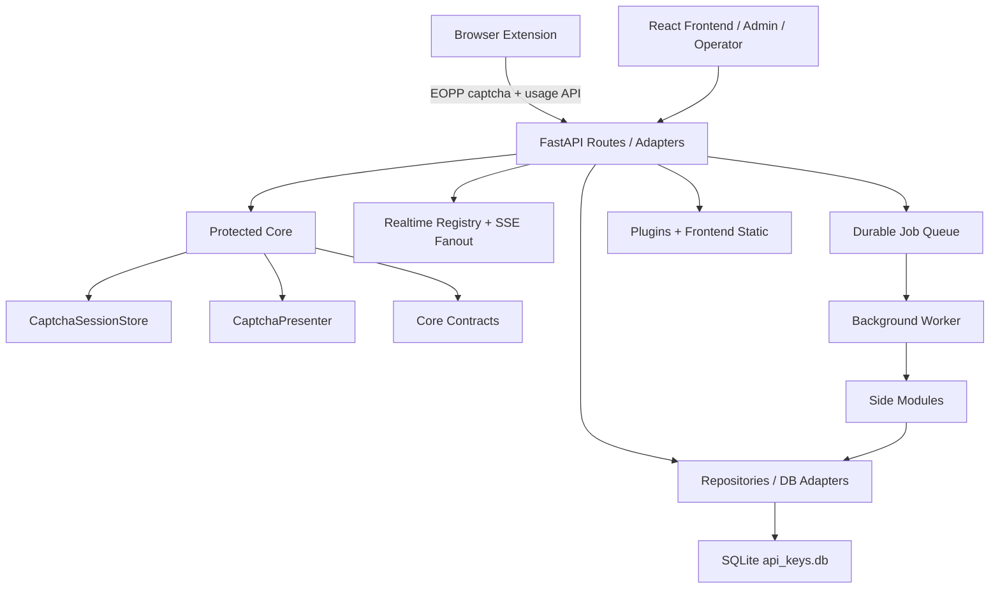
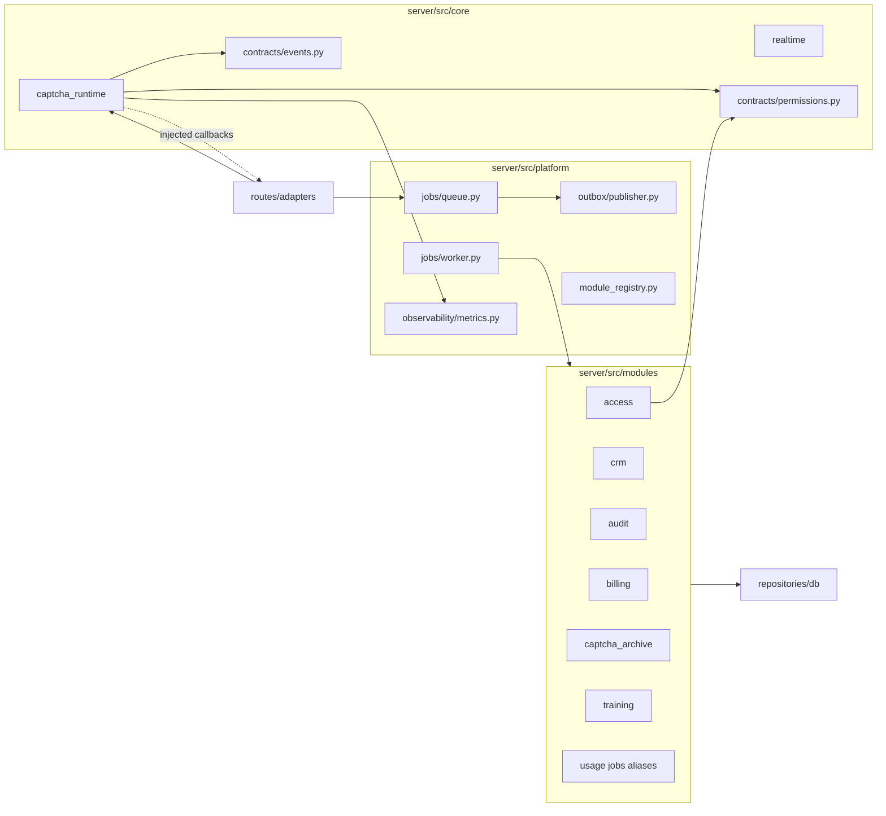

# Architecture

## High-Level System

## Core Vs Side Modules

The import-linter contract currently keeps `server.src.core` from importing
`server.src.modules`, admin routes, finance repositories, prepaid/invoice services,
telegram, training routes, or plugin routes.

## Existing Layers

| Layer | Current files | Role | Audit result |
|---|---|---|---|
| Core | `server/src/core/*` | captcha runtime, realtime primitives, contracts | boundary kept by import-linter |
| Platform | `server/src/platform/*` | jobs, outbox, modules, metrics | implemented; worker is sync drain loop |
| Modules | `server/src/modules/*` | side features and optional manifests | billing/training manifest; jobs for billing/CRM/archive/usage |
| Routes/adapters | `server/src/routes/*` | HTTP shell, dependency injection, legacy compatibility | core routes are thinner; admin remains large |
| Repositories/db | `server/src/repositories/*`, `server/src/db/*` | persistence and older DB helpers | mixed SQLAlchemy and raw sqlite legacy |
| Migrations | `server/migrations/versions/*` | active Alembic tree | root `server/alembic.ini` points at this tree |
| Realtime | `server/src/core/realtime`, `server/src/sse` | bounded queues and compatibility globals | nonblocking fanout implemented |
| RBAC/audit | `modules/access`, `modules/audit`, `policies/access_policy.py` | admin authorization and audit | centralized enough for Phase 5 |
| Billing/CRM | `modules/billing`, `modules/crm` | deferred side effects | split model exists; aliases remain |
| Delivery | `scripts/deploy/*`, `server/deploy/docker-compose.yml` | release, backup, rollback | much stronger than old flow; symlink order risk |
| Frontend/admin | `frontend/src/*` | user/admin/operator UI | out of core boundary |
| Extension/plugins | `extension/*`, `plugins/` | browser automation and plugin release | plugin-only release script exists |

## Frontend/Admin Surface

CodeGraph surfaced these main frontend entry points:

- `frontend/src/AdminPage.jsx` - admin shell that owns auth/session restore,
  RBAC-derived navigation, layout, and tab routing through
  `frontend/src/features/admin/shared/tabs.js`.
- `frontend/src/components/admin/OperatorsTab.jsx` - admin operator/link/distribution answer
  management. It reads `/admin/operators`, `/admin/operator-links`,
  `/admin/distribution-answers`, `/api-keys`, and `/admin/companies`.
- `frontend/src/pages/OperatorPage.jsx` - operator realtime queue UI. It is tightly coupled to
  SSE message shapes such as `new_captcha`, distribution assignments, markers, and fellow
  operators.
- `frontend/src/pages/HistoryTab.jsx` and usage/admin components depend on `UsageLog` fields
  that are now asynchronously enriched (`price`, `company`, `is_test`, `invoice_id`).

Product risk: admin/reporting views must tolerate temporarily incomplete rows while CRM and
billing jobs are pending. In particular, a confirmed usage can be correct even when `price` and
`invoice_id` are still empty.

## Extension / Plugin Surface

CodeGraph surfaced these main extension entry points:

- `extension/src/api/pipeline.ts`, `stages.ts`, and `background.ts` implement the five-stage
  extension flow: slots, captcha, solving, validating, submitting.
- `extension/src/components/ProgressSteps.tsx` declares the visible stage order.
- `extension/src/types.ts` contains the EOPP contract types used by the pipeline.
- `scripts/deploy/push-plugins.ps1` builds extension assets, packs CRX when possible, writes
  `update.xml`, creates a plugin release manifest, and switches the release-bound plugin path.

Product risk: plugin-only releases currently advance the production `current` symlink as a
release. That is coherent with the new release model, but it can make code and plugin release
history interleave; the owner should confirm this is desired.

## Non-Negotiable Rule Check

| Rule | Status | Evidence / concern |
|---|---|---|
| Core does not import side modules | Pass | `uv run lint-imports`: contract kept |
| Side-module failure does not break captcha solve | Mostly pass | archive/metadata deferred; focused tests include failure cases, but smoke latency fails |
| Slow operator does not block others | Pass in focused tests | `tests/test_realtime_fanout.py` passed |
| Billing/CRM/archive jobs idempotent | Mostly pass | job idempotency keys exist; prepaid deduction relies on unique `usage_log_id` |
| Training jobs idempotent | Unknown | training manifest exists, no audited job handler found |
| Peak fast mode disables heavy sync work | Pass with worker debt | archive/metadata/billing/captcha-record side work is deferred; monitor worker retry/dead-letter queues |
| Deploy creates release manifest and backup | Pass by static tests | `server/tests/test_deploy_scripts.py` passed |
| Rollback selects release manifest | Pass by static tests | no `docker images | head -1`; selected/previous release manifest |
| Full state promotion has backup/diff/restore | Mostly pass | diff is printed; no persisted diff bundle observed |
| Legacy deploy/data/plugin scripts do not conflict | Partial | scripts now share release helpers; plugin-only advances `current` |

## Key Architectural Findings

### Protected Core Is Real But Not Fully Pure

`routes/captcha.py` now delegates `/solve-captcha` and `/solve` to `CaptchaRuntime`.
The runtime takes injected callbacks for API-key validation, storage, SSE, icon
distribution, timeout handling, auto-solve, and metadata enqueueing. This is the
right boundary shape.

The adapter still contains a large `_prepare_icon_session()` bridge that imports
distribution routes, operator routes, `auto_operator`, and realtime manager helpers. That is
acceptable as adapter wiring, but it is the next migration target if icon-click
distribution becomes part of a formal core contract.

### Runtime Latency Needs Attention

Focused smoke tests fail because pending session visibility exceeds the 2s wait.
A diagnostic run observed:

- pending empty at request start;
- pending session appears at about 5.6s;
- `/solve-captcha` returns timeout after 10s when no manual answer is submitted.

That suggests work before display dispatch is too slow in the tested path. Root cause
needs profiling across API-key validation, usage creation, presenter build, and DB setup.

### Side Work Is Mostly Deferred

Confirmed usage now atomically updates core fields and enqueues billing/captcha jobs.
Registration creates a minimal pending row and enqueues CRM enrichment. Captcha archive and
solver metadata can be deferred by flags.

`fail_usage()` is the exception: it still creates captcha records synchronously when logs are
present. This should become a `captcha_records` job with `status="failed"`.

### Optional Modules Are Defensive

`ModuleManifest` and `register_modules()` load optional modules after core routers. A broken
manifest disables only that module and is visible via health. Current default manifests are
billing and training; job handlers are still registered by the worker.
