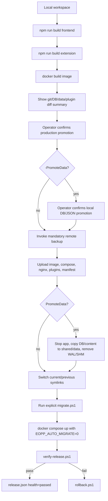
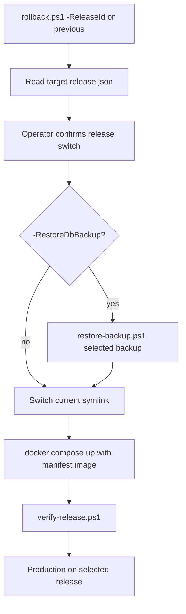

# Deployment

## Release Model

The deployment scripts now use a release identity:

```text
YYYYMMDD_HHMMSS-<short_git_sha>
```

A release contains:

- Docker image tag.
- `docker-compose.yml`.
- `nginx-default.conf`.
- release-bound `plugins/`.
- `release.json`.
- mandatory backup id.
- checksums for compose, nginx, plugins, and optionally data.

## Deployment / Code Promotion By Default



`deploy.ps1` does not promote local `server/data` by default. Use
`-PromoteData` or `make deploy-full-state` only when replacing production
`shared/data` is intentional.

Audit risk: `deploy.ps1` switches `current` before migration and health verification. If a
candidate migration fails, rollback runs, but the candidate was already current during the
migration step. A safer pattern is stage -> migrate candidate -> start/verify candidate ->
promote symlink.

## Rollback / Restore



Rollback no longer selects a random old Docker image. DB restore is explicit and tied to a
backup id.

## Backup / Restore Rules

`Invoke-RemoteBackup` backs up:

- SQLite DB via `.backup` when sqlite3 is available.
- WAL/SHM files when present.
- `captcha_examples/`.
- current release plugins.
- compose/nginx/current release manifest.

`restore-backup.ps1`:

- requires a backup id;
- prints the backup release id;
- stops the app;
- creates an emergency copy of the current DB;
- restores `api_keys.db`;
- removes WAL/SHM consistently;
- starts current app image and verifies.

## Verification

`verify-release.ps1` checks:

- `current` symlink and `current/release.json`.
- Docker Compose status.
- root HTTP response.
- plugin update endpoint response.
- SQLite `PRAGMA integrity_check`.
- Alembic current.
- referenced backup exists.

## Remaining Deployment Gaps

| Gap | Risk | Recommended action |
|---|---|---|
| Symlink switches before candidate migration/health | failed candidate becomes current temporarily | migrate/start candidate before switching current |
| Diff summary is printed, not persisted as a release artifact | hard to audit later | write `diff/*.json` and `files_changed.txt` into release dir |
| Deploy tests are static token checks | scripts may pass tests while runtime sequence breaks | add mocked shell/integration tests for promotion/rollback paths |
| Plugin-only release advances `current` | code release and plugin release history may interleave | decide whether plugin releases are full releases or child manifests |
