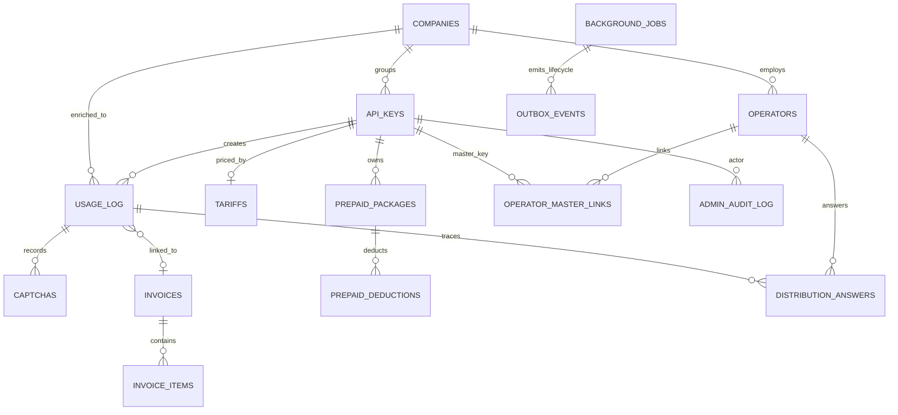

# Entities

## ER Diagram

## Entity Audit

### ApiKey

- Purpose: authenticates clients/admins, owns usage limits, tariffs, company, super-kiosk/admin flags.
- Created by: `/api-keys` admin route/repository.
- Changed by: admin API-key routes.
- Read by: captcha validation, usage registration/confirmation, RBAC, admin UI, realtime labels.
- Lifecycle: active key -> usage_count increments on confirmed usage -> may become inactive or limit-exceeded.
- Source of truth: `key`, `active`, `usage_count`, `max_uses`, `is_admin`, `admin_role`, `is_super_kiosk`, `company_id`.
- Computable later: debt, remaining uses, labels for display.
- Peak invariant: validation must be fast; billing/company lookups must not block captcha display.

### UsageLog

- Purpose: core business record for one reservation attempt.
- Created by: `/register-usage` or captcha fallback `get_or_create_usage_log()`.
- Changed by: `/confirm-usage`, `/fail-usage`, CRM/billing/captcha-record jobs, admin edits.
- Read by: admin reports, billing jobs, captcha record parsing, API key history.
- Lifecycle: `pending` -> `confirmed` or `failed`; then enriched and priced asynchronously.
- Source of truth: `status`, `api_key_id`, `reservation_id`, `created_at`, `confirmed_at`, `slot_date`, `logs`.
- Computable later: `op_type`, `company`, `company_id`, `fio`, `vehicle_number`, `is_test`, `has_custom_slots`, `price`, `invoice_id`.
- Peak invariant: confirm only changes atomic status/logs/usage_count; finance and parsing are deferred.

### CaptchaRecord

- Purpose: normalized history of captchas found in usage logs.
- Created by: `captcha_records` job or legacy direct parser.
- Changed by: parser/upsert logic.
- Read by: admin captcha history and training views.
- Lifecycle: parsed from confirmed/failed logs -> used for reporting/training.
- Source of truth: `captcha_id`, `usage_log_id`, `status`, `created_at`.
- Computable later: `tiles_hash`, `duration_ms`, `fail_reason`.
- Peak invariant: parsing logs must not delay usage confirm/fail.

### CaptchaFile

- Purpose: index of archived captcha JSON files and labeling/training metadata.
- Created by: captcha archive/index jobs or sync archive when enabled.
- Changed by: labelers, metadata backfills, file sync.
- Read by: admin captcha files, training/classifier tooling.
- Lifecycle: observed payload -> JSON archive -> metadata/label enrichment -> training dataset.
- Source of truth: `captcha_id`, `file_path`, labels (`valid_index`, `manual_labeled`, `label_source`).
- Computable later: solver metadata, file size/mtime, classification, coordinates flags.
- Peak invariant: archive and solver metadata must be deferrable.

### Tariff

- Purpose: pricing rules per API key.
- Created/changed by: admin billing routes.
- Read by: billing jobs.
- Lifecycle: one tariff per key, updated over time.
- Source of truth: `price_create`, `price_reschedule`, `price_create_peak`, `price_custom_slots`.
- Computable later: actual `UsageLog.price`.
- Peak invariant: tariff lookup must not happen in confirm hot path.

### Invoice

- Purpose: billing aggregation and PDF/document state.
- Created/changed by: admin invoice routes and billing invoice-link job.
- Read by: admin billing/payout flows.
- Lifecycle: open company invoice -> linked usage/items -> generated PDF -> paid/closed.
- Source of truth: `invoice_number`, `company`, `is_open`, `paid`, `debt_amount`, `total_amount`.
- Computable later: derived totals from usage/items when regeneration is allowed.
- Peak invariant: invoice linking/generation must be worker/admin side work.

### PrepaidPackage

- Purpose: prepaid balance bucket for an API key.
- Created/changed by: admin prepaid routes and billing deduction job.
- Read by: billing/admin.
- Lifecycle: active package with balance -> deductions -> depleted/inactive.
- Source of truth: `balance_amount`, `active`, deduction rows.
- Computable later: consumed total and remaining balance from deductions, if desired.
- Peak invariant: prepaid deduction must not block `/confirm-usage`.

### Company

- Purpose: normalized business customer grouping for keys/operators/usage.
- Created by: CRM enrichment and admin company routes.
- Changed by: admin company routes.
- Read by: billing, operators, reports.
- Lifecycle: alias/name discovered -> company row -> linked keys/operators/usage.
- Source of truth: `name`; aliases/notes are enrichment.
- Computable later: usage counts, debt, invoices.
- Peak invariant: company parsing/creation must not block registration.

### Operator

- Purpose: human operator endpoint and assignment metadata for icon-click captcha distribution.
- Created/changed by: admin operator routes.
- Read by: operator stream routes, realtime registry refresh.
- Lifecycle: created with uuid -> linked to masters -> online while connected -> answers captchas.
- Source of truth: `uuid`, `nickname`, `allowed_master_keys`, `icon_display_mode`, `company_id`.
- Computable later: online state from connections; persisted `online` should be treated carefully.
- Peak invariant: captcha fanout should use registry snapshots, not DB lookups.

### OperatorMasterLink

- Purpose: many-to-many relationship between operators and master API keys.
- Created/changed by: admin link/relink routes.
- Read by: realtime registry and operator UI.
- Lifecycle: active link -> registry snapshot -> optional unlink/relink.
- Source of truth: `operator_id`, `master_key_id`, `active`.
- Computable later: slot order and distribution assignments.
- Peak invariant: topology changes update registry before captcha fanout.

### DistributionAnswer

- Purpose: stores operator icon-click coordinate answers.
- Created by: distribution answer endpoint.
- Changed by: normally append-only.
- Read by: admin/operator analytics and captcha completion logic.
- Lifecycle: assigned icon -> operator clicks -> answer row -> distribution completes.
- Source of truth: `captcha_id`, `operator_id`, `icon_position`, `x`, `y`, `created_at`.
- Computable later: answer duration summaries.
- Peak invariant: one operator answer must not block other operators or owner.

### AuditLog

- Purpose: security/admin/business audit trail in `admin_audit_log`.
- Created by: `AuditService` and legacy wrappers.
- Changed by: append-only.
- Read by: `/admin/audit`.
- Lifecycle: security/admin sync writes; business audit outbox events can later be consumed.
- Source of truth: `action`, `category`, `admin_id`, `actor_role`, `permission`, `timestamp`, metadata.
- Computable later: reports and filters.
- Peak invariant: security/admin audit can be sync for sensitive changes; business audit best-effort.

### BackgroundJob / OutboxEvent

- Purpose: durable side-work and lifecycle/event log.
- Created by: `enqueue_deferred_job()` and `publish_event()`.
- Changed by: worker transitions and outbox dispatcher helpers.
- Read by: worker, tests, diagnostics.
- Lifecycle: pending -> running -> done / pending retry / dead.
- Source of truth: `background_jobs.status`, `attempts`, `next_retry_at`, `idempotency_key`.
- Computable later: lag, failure metrics, dead-letter reports.
- Peak invariant: enqueue failures are caught in hot paths; worker failures never escape to HTTP.

### User / Role / Permission

- Purpose: `User` currently supports finance attribution; admin roles live on `ApiKey.admin_role`.
- Created/changed by: admin user/API-key routes.
- Read by: invoices, payouts, RBAC.
- Lifecycle: user row for finance attribution; admin key role maps to permission set.
- Source of truth: `ApiKey.admin_role` for RBAC, `modules/access/permissions.py` for grants.
- Computable later: effective permissions and actor labels.
- Peak invariant: core may only see primitive `AccessDecision`, not RBAC tables.

## Interactive Entity Validation Checklist

Use this checklist with the product owner before deleting or migrating legacy paths.

| Entity | Question to confirm expected behavior |
|---|---|
| ApiKey | Should `usage_count` increment only after `/confirm-usage`, never after captcha solve or failed usage? |
| ApiKey | Should old admin API keys without `admin_role` continue to behave as `super_admin` forever, or only during migration? |
| UsageLog | Is it acceptable that `company`, `fio`, `vehicle_number`, `is_test`, `price`, and `invoice_id` are filled later by jobs? |
| UsageLog | Should failed attempts remain billable/visible in reports, or only confirmed attempts? |
| CaptchaRecord | Can failed usage captcha parsing be delayed by background jobs, or must failed records appear immediately? |
| CaptchaFile | Is solver metadata (`solver_top3`, `solver_results`, `solver_valid_rank`) allowed to be missing until archive jobs run? |
| Tariff | Should tariff changes affect only future confirmations, or also unpriced confirmed rows when billing jobs run later? |
| Invoice | Should open invoice linking happen automatically for every unpaid company usage, or only after admin action? |
| PrepaidPackage | If prepaid deduction fails and retries later, should admin reports show the usage as unpaid until retry succeeds? |
| Company | Should company creation be automatic from injector config, or should unknown companies remain unlinked until admin review? |
| Operator | Answered: `online` should be derived from active realtime/SSE connections and reset on restart; DB is not the source of truth for live presence. |
| OperatorMasterLink | Should changing links affect already pending distributed captchas, or only future captchas? |
| DistributionAnswer | Should answers be append-only audit records, or can corrections overwrite previous coordinates? |
| AuditLog | Which events must be synchronous besides login, API-key change, and role change? |
| BackgroundJob | Answered: old aliases (`usage_enrich`, `billing_confirm`) may be removed in a planned blocking release after stopping workers/processes and handling old queued rows. |
| OutboxEvent | Is `audit.business` only an internal durable log, or should it later publish to an external sink? |
| User/Role/Permission | Are the current roles (`super_admin`, `manager`, `operator`) enough for production, or do finance/admin roles need splitting? |
