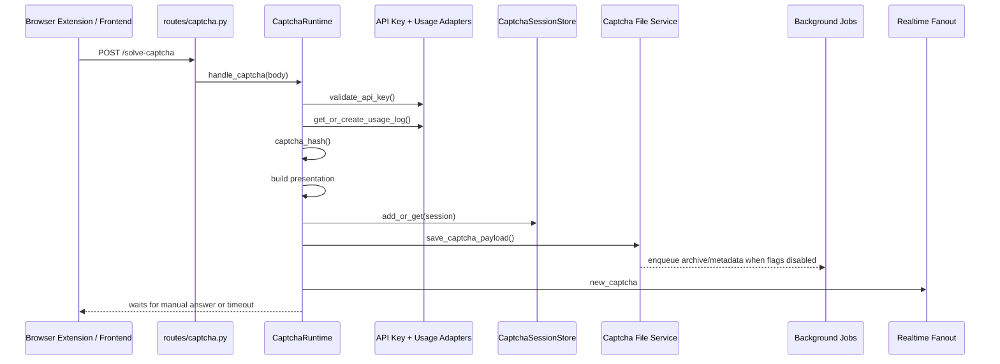
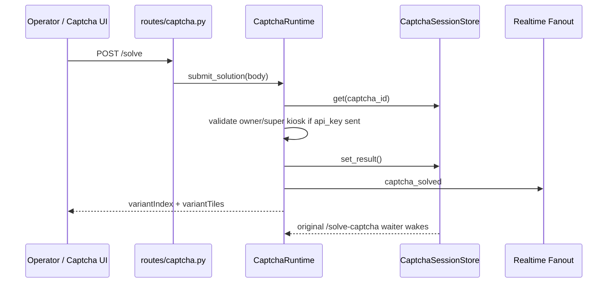
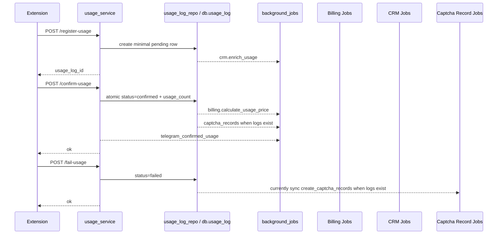
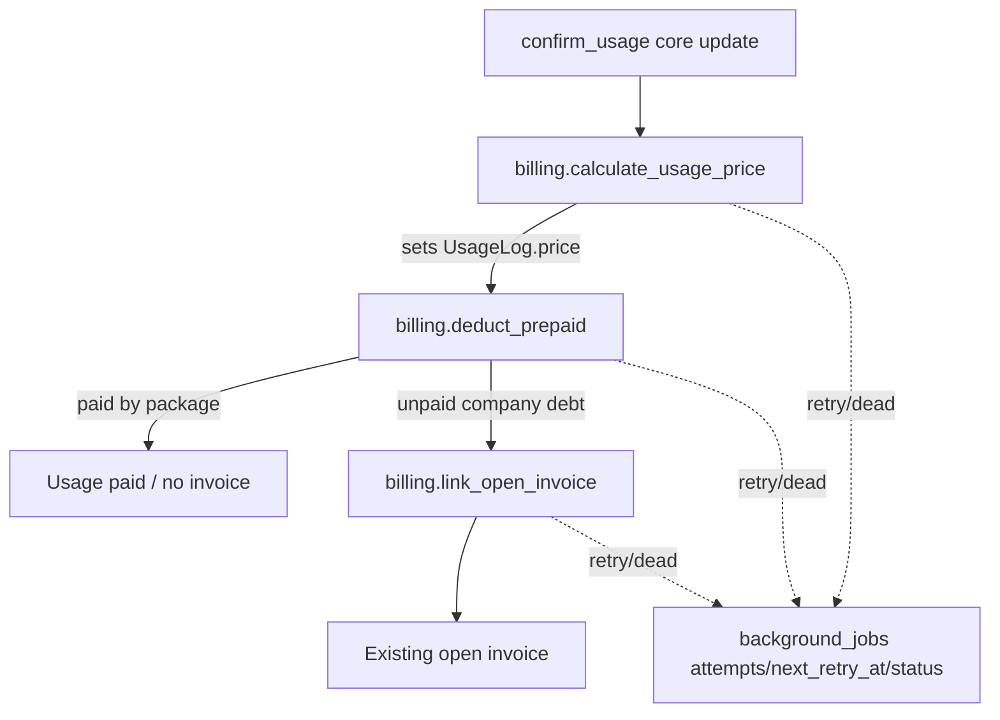
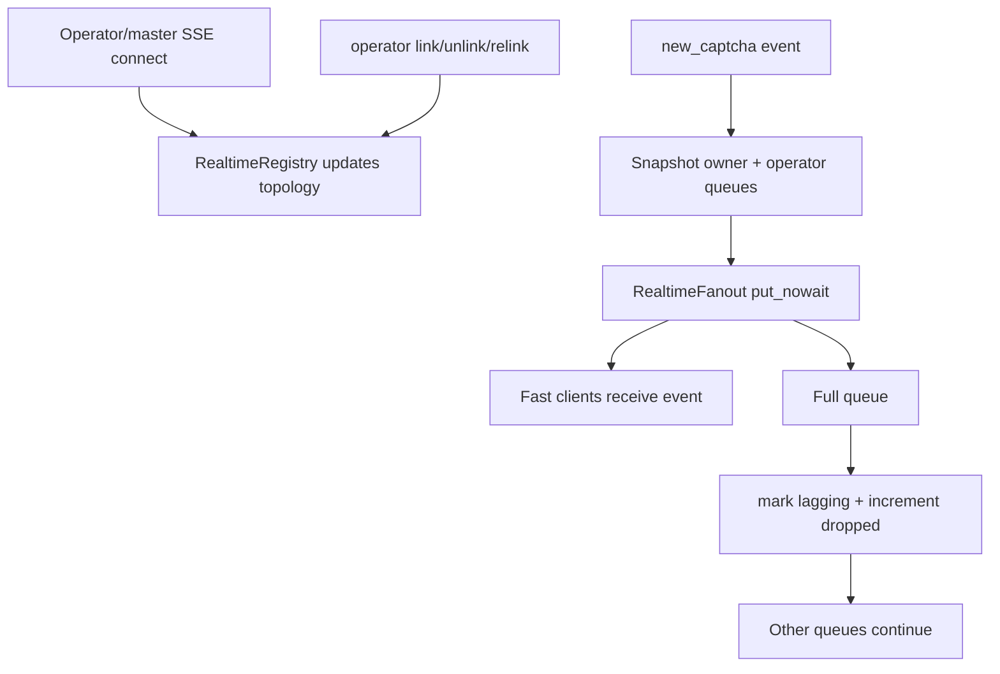
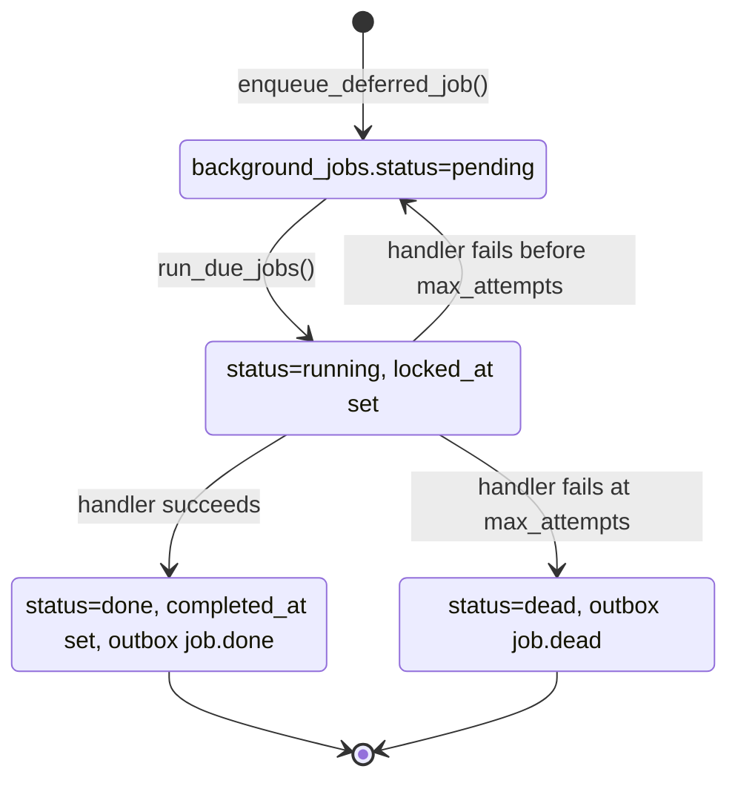
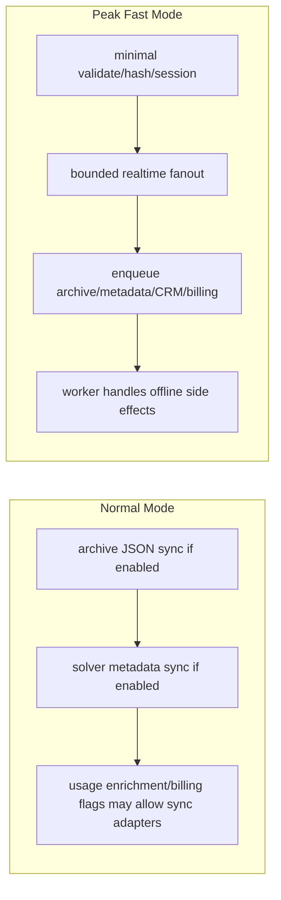

# Flows

## `/solve-captcha`

Audit note: pending insertion was observed late in smoke diagnostics, around 5.6s. The
intended peak behavior is display dispatch under 300 ms excluding human wait.

## `/solve` Manual Answer

## Usage Register / Confirm / Fail

Audit note: the fail lane should enqueue `captcha_records` instead of synchronous parsing.

## Billing Deferred Flow

`PrepaidDeduction.usage_log_id` is unique, so re-running deduction cannot double-deduct the
same usage when the DB helper respects that uniqueness.

## Operator Realtime Fanout

Fanout uses bounded queues and does not await client queues. Slow clients are marked lagging,
not removed.

## Job / Outbox Lifecycle

Outbox events currently record lifecycle and business audit events. External dispatch is not
yet a major audited runtime dependency.

## Peak Mode Lane

Peak windows are scheduled for Moscow time 09:50-10:10 and 11:50-12:10, plus forced
`EOPP_PEAK_FAST_MODE=1`.

